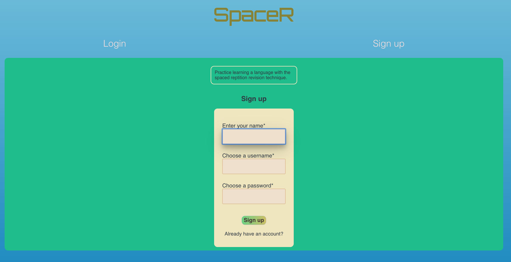
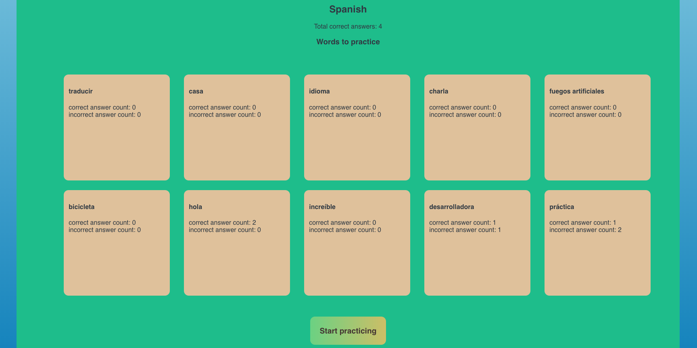
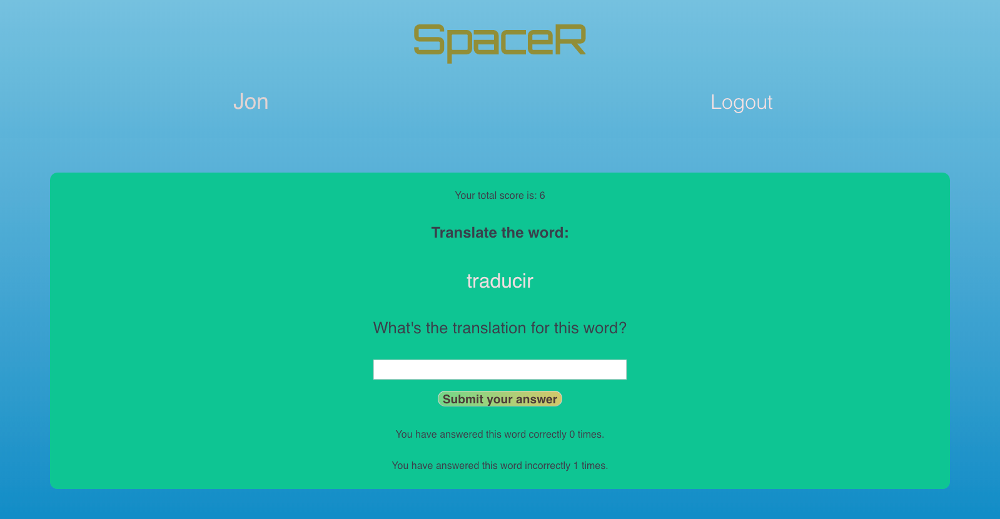
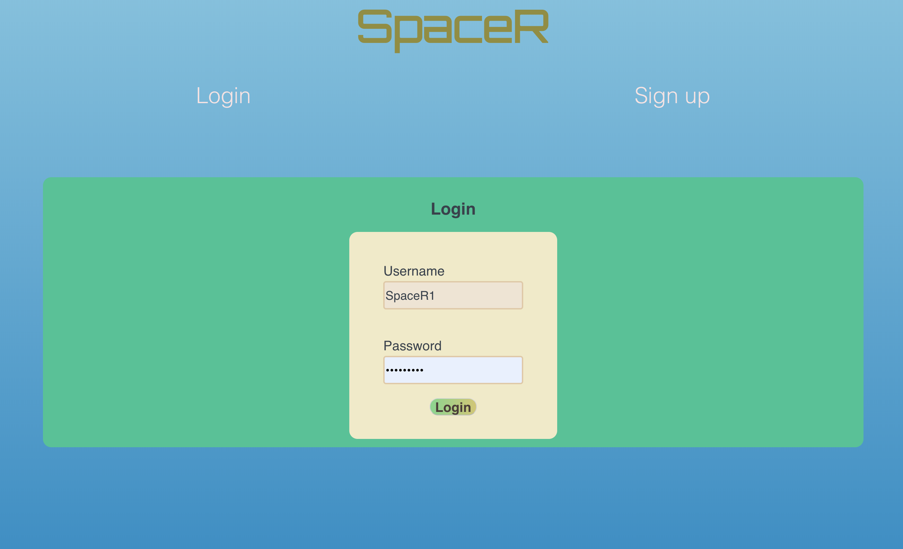
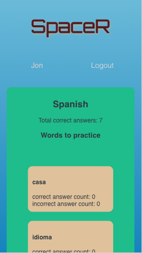

# <ins>SpaceR 
## A Spaced Repetition Application for Language Learners

Developed by Dana Zinatbakhsh and Jonathan Jackson

## Summary 
<i>SpaceR</i> is an application designed to help users memorize words in a foreign language. <i>SpaceR</i> uses the evidence-based learning technique of <i>spaced repetition</i> to provide an interactive learning experience for the user. A foreign word is displayed on the screen, prompting the user to type in the English translation of the word. The user then receives feedback on their answer - whether it was correct or incorrect. The foreign word is then shuffled back into the "stack" of vocabulary words. Words that the user translated incorrectly are shown more frequently than words that were correctly translated in order to reinforce learning of the vocabulary.

## Technologies Used
* Client: React
* Web Server: Node and Express with PostgreSQL 
* Database: PostgreSQL hosted on Heroku
* Tests: Supertest, Mocha, Chai, Cypress

### A live link to the project is available here: https://space-r.now.sh/

### GitHub Repo for Client: https://github.com/MrNanosh/spaced-repetition
### GitHub Repo for Server: https://github.com/MrNanosh/spaced-repetition-api

### Screenshots:











## API Endpoints
The following API endpoints are available. The GET request to the /api/language endpoint returns database values for spaced repetition learning components.

`POST to
/api/auth`:
```json
{
"username": "----",
"password": "----"
}

GET to
'/api/language':

{
  "language":{
    "id":1,
    "name":"Spanish",
    "user_id":1,
    "head":1,
    "total_score":0
    },
    "words":[
      {
        "id":1,
        "language_id":1,
        "original":"hola",
        "translation":"hello",
        "next":2,
        "memory_value":1,
        "correct_count":0,
        "incorrect_count":0
        }
        ...
```
POST to
'/api/user':
```json
{
"username": "admin",
"name": "sample",
"password": "P@ssword8CharactersAtLeast"
}


## Setup

To setup the application

1. Fork and clone the project to your machine
2. `npm install`. This will also install the application *Cypress.io* for running browser integration tests

The project expects you have the Spaced repetition API project setup and running on http://localhost:8000.

Find instructions to setup the API here https://github.com/Thinkful-Ed/spaced-repetition-api.

## Running project

This is a `create-react-app` project so `npm start` will start the project in development mode with hot reloading by default.

## Running the tests

This project uses [Cypress IO](https://docs.cypress.io) for integration testing using the Chrome browser.

Cypress has the following expectations:

- You have cypress installed (this is a devDependency of the project)
- You have your application running at http://localhost:3000.
  - You can change the address of this expectation in the `./cypress.json` file.
- Your `./src/config.js` is using http://localhost:8000/api as the `API_ENDPOINT`

To start the tests run the command:

```bash
npm run cypress:open
```

On the first run of this command, the cypress application will verify its install. Any other runs after this, the verification will be skipped.

The command will open up the Cypress application which reads tests from the `./cypress/integration/` directory. You can then run individual tests by clicking on the file names or run all tests by clicking the "run all tests" button in the cypress GUI.

Tests will assert against your running localhost client application.

You can also start all of the tests in the command line only (not using the GUI) by running the command:

```bash
npm run cypress:run
```

This will save video recordings of the test runs in the directory `./cypress/videos/`.
