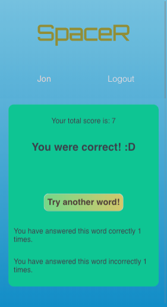

# <ins>SpaceR 
## A Spaced Repetition Application for Language Learners

Developed by Dana Zinatbakhsh and Jonathan Jackson

## Summary 
<i>SpaceR</i> is an application designed to help users memorize words in a foreign language. <i>SpaceR</i> uses the evidence-based learning technique of <i>spaced repetition</i> to provide an interactive learning experience for the user. A foreign word is displayed on the screen, prompting the user to type in the English translation of the word. The user then receives feedback on their answer - whether it was correct or incorrect. The foreign word is then shuffled back into the "stack" of vocabulary words. Words that the user translated incorrectly are shown more frequently than words that were correctly translated in order to reinforce learning of the vocabulary.

## Technologies Used
* Client: React
* Web Server: Node and Express with PostgreSQL 
* Database: PostgreSQL hosted on Heroku
* Tests: Supertest, Mocha, Chai, Cypress

### A live link to the project is available here: https://space-r.now.sh/

### GitHub Repo for Client: https://github.com/MrNanosh/spaced-repetition
### GitHub Repo for Server: https://github.com/MrNanosh/spaced-repetition-api

### Screenshots:





## API Endpoints
The following API endpoints are available. The GET request to the /api/language endpoint returns database values for spaced repetition learning components.

`POST to
/api/auth`:
```json
{
"username": "----",
"password": "----"
}

GET to
'/api/language':

{
  "language":{
    "id":1,
    "name":"Spanish",
    "user_id":1,
    "head":1,
    "total_score":0
    },
    "words":[
      {
        "id":1,
        "language_id":1,
        "original":"hola",
        "translation":"hello",
        "next":2,
        "memory_value":1,
        "correct_count":0,
        "incorrect_count":0
        }
```
        ...
```json
POST to
'/api/user':
```json
{
"username": "admin",
"name": "sample",
"password": "P@ssword8CharactersAtLeast"
}


